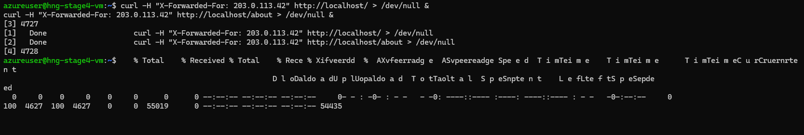
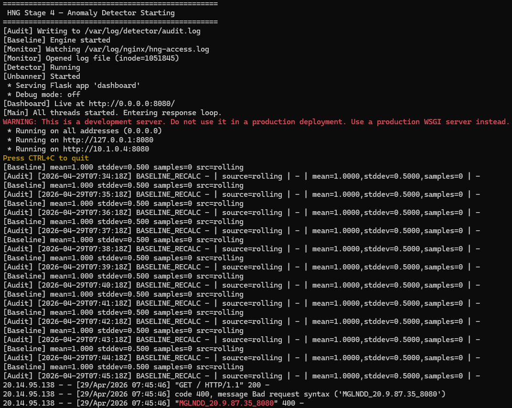
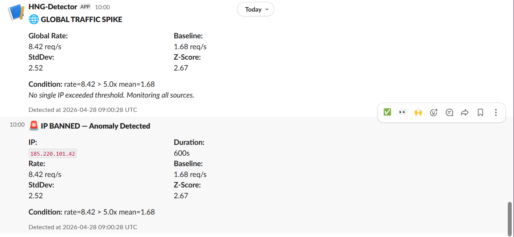
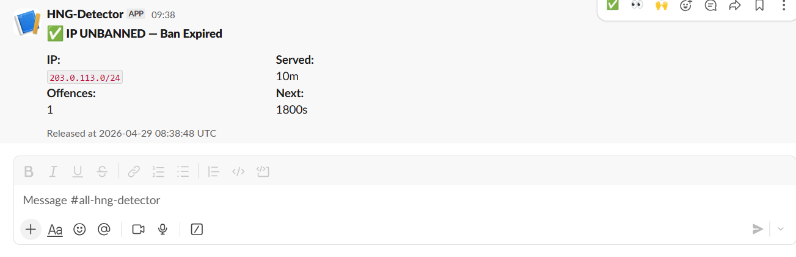
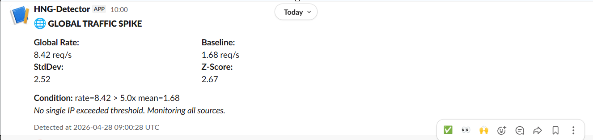
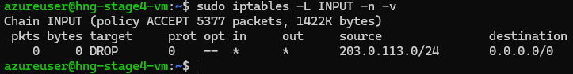
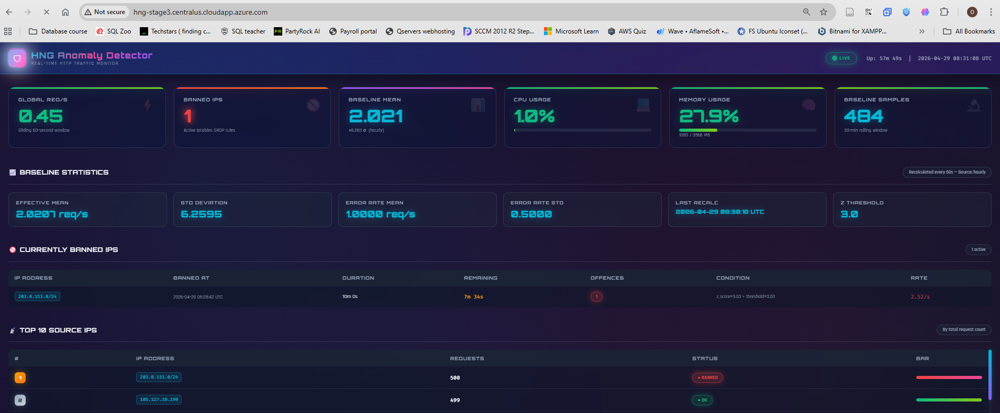
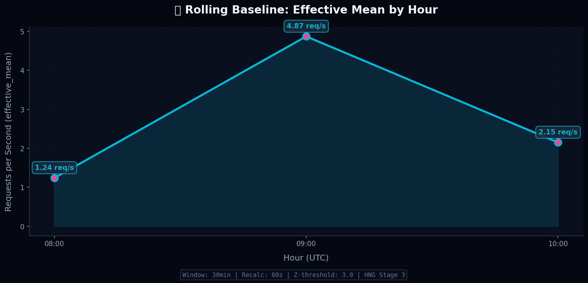

# 📸 Required Screenshots - HNG Stage 4

This directory contains the 7 mandatory screenshots for the Anomaly Detection Engine submission.

| # | Filename | Description | Status |
|---|----------|-------------|--------|
| 1 | `Tool-running.png` | Daemon running, processing log lines | ✅ Captured |
| 2 | `Ban-slack.png` | Slack notification when IP is blocked | ✅ Captured |
| 3 | `Unban-slack.png` | Slack notification when IP is auto-unbanned | ✅ Captured |
| 4 | `Global-alert-slack.png` | Slack alert for global traffic anomaly | ✅ Captured |
| 5 | `Iptables-banned.png` | `sudo iptables -L -n` showing blocked IP | ✅ Captured |
| 6 | `Audit-log.png` | Structured audit log with ban/unban/baseline events | ✅ Captured |
| 7 | `Baseline-graph.png` | Baseline over time showing 2+ hourly slots with different effective_mean | ✅ Captured |

> 💡 **Pro Tip**: All screenshots should show your Azure VM's public IP or hostname in the terminal title/window to prove they're from your live environment.

---
## Daemon running, processing log lines.

## Slack notification when IP is blocked.

## Slack notification when IP is auto-unbanned.

## Slack alert for global traffic anomaly.

## `sudo iptables -L -n` showing blocked IP

## Structured audit log with ban/unban/baseline events.

## Baseline over time showing 2+ hourly slots with different effective_mean 
